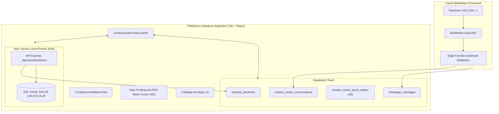

# 📋 Informe Ejecutivo de Actividades y Cronograma de Jornada
**Plataforma Sanatorio Argentino — Innovación y Transformación Digital / Grow Labs**  
**Fecha:** Lunes, 21 de Septiembre de 2026  
**Líder Técnico / Consultor:** Grow Labs Integrado  
**Supervisión / Operaciones:** Lic. Lucas Marinero  
**Sistema:** Plataforma Sanatorio Argentino (ADM-QUI & Contact Center Omnicanal)

---

## 🎯 1. Resumen Ejecutivo de la Jornada

Durante la jornada del 21 de septiembre de 2026 se llevó a cabo un sprint integral de desarrollo, estabilización y puesta a punto operativa sobre el ecosistema de **Contact Center**, **Chatbot Institucional WhatsApp** y la integración directa en tiempo real con el padrón hospitalario **SALUS** y **Supabase**.

Los objetivos cumplidos abarcaron desde la arquitectura de seguridad y permisos (RBAC para agentes autorizadas), análisis clínico automatizado con Inteligencia Artificial (visión computacional sobre pedidos médicos), optimización integral del flujo del paciente en el chatbot, incorporación masiva del catálogo oficial de respuestas rápidas de AsisteClick (93 plantillas activas), visor profesional multiformato de documentos médicos y la resolución definitiva de casos de gestión familiar y tiempos de respuesta.

---

## ⏱️ 2. Cronograma Detallado de Tareas y Commits

A continuación se detalla la línea de tiempo de despliegues y commits realizados a lo largo del día:

### 🌅 Bloque Mañana: Seguridad, SALUS 360°, Visión IA y Atajos Rápidos

| Horario | Commit | Tipo | Descripción de la Tarea / Hito Cumplido |
| :--- | :---: | :---: | :--- |
| **09:58:54** | `9a17e1b` | `feat` | **RBAC y Seguridad Operativa Contact Center:** Implementación de control de acceso por usuario (`isUserAuthorizedForContactCenter`), aislamiento de agentes habilitadas (Daniela, Virginia, Sofia, Erica y supervisión Lucas Marinero) y contadores dinámicos por agente. |
| **10:19:38** | `622bf48` | `feat` | **Análisis de Órdenes Médicas con IA:** Integración de Edge Function con GPT-4o Vision para auditar recetas/órdenes enviadas por foto, extrayendo profesional solicitante, diagnóstico y estudios requeridos. |
| **10:29:18** | `ee0501b` | `feat` | **Resumen IA Clínico y Matching de Prestadores:** Generación automática de resumen de la consulta y mapeo en tiempo real de médicos de SALUS por apellido o especialidad. |
| **10:40:24** | `e00f795` | `feat` | **Normalización Telefónica y Ficha 360° SALUS:** Soporte para múltiples variantes de prefijos argentinos (`+549`, `54`, `0`, `15`) y cruce directo con consultas históricas de SALUS. |
| **10:49:08** | `1556e45` | `feat` | **Motor de Atajos Rápidos (`/`):** Implementación del sistema de autocompletado en $O(1)$ con navegación por teclado (`Enter` para enviar, `Tab` para editar) y modal de exploración. |
| **11:01:23** | `3cc2353` | `fix` | **Sincronización Híbrida Realtime + Heartbeat:** Suscripción a eventos de Supabase con sondeo periódico de respaldo para garantizar cero desconexiones. |
| **11:04:48** | `d02533d` | `fix` | **Alineación de Contexto IA:** Ordenamiento cronológico de mensajes para garantizar resúmenes precisos sin alucinaciones temporales. |
| **11:32:00** | `78c7faf` | `feat` | **Historial Clínico Enriquecido:** Mapeo de síntomas, evoluciones médicas y turnos próximos presenciales y online agendados por DNI. |
| **11:35:47** | `50e1638` | `feat` | **Modal Institucional de Reinicio de Bot:** Reemplazo de alertas nativas por modal médico con confirmación y retroalimentación auditiva/visual. |
| **11:40:57** | `af174a3` | `feat` | **Aviso de Demora Estimada y Horarios:** Configuración en el chatbot del mensaje oficial de demora (30 min a 1 h) y horarios de atención humana. |
| **11:42:51** | `2d41711` | `fix` | **Normalización de Nombres de Agentes:** Ajuste ortográfico institucional en selectores y atajos para Sofia Olivieri y Virginia Jacques. |
| **11:53:59** | `939aa03` | `fix` | **Pestaña Historial 360°:** Optimización del rendimiento de renderizado en antecedentes de consultas de SALUS. |
| **11:58:20** | `c16536a` | `feat` | **Sincronizador Periódico SALUS (`sync-server`):** Carga automatizada diaria de diagnósticos, turnos online y parámetros de prestadores. |
| **12:17:40** | `0e5e5c9` | `feat` | **Encuesta de Calidad Automática:** Envío del enlace oficial de calificación de 5 estrellas al ejecutar la acción *Finalizar Atención*. |
| **12:27:36** | `d43a085` | `fix` | **Corrección Ortográfica Institucional:** Ajuste del mensaje de despedida a *"finalizada"*. |
| **12:35:49** | `187cdaf` | `feat` | **Pestaña de Chats Finalizados:** Consolidación de estados cerrado/archivado/finalizado y corrección de salto de selección. |
| **12:45:37** | `9c14319` | `fix` | **Chequeo Preventivo de Salud:** Flujo guiado en el bot que evita asociar a un médico particular indebido, aclarando que es un circuito multidisciplinario. |
| **12:56:23** | `a53c0c0` | `feat` | **Programa Prevenir OSP:** Respuestas parametrizadas institucionales para planes de prevención de Obra Social Provincia. |

---

### ☀️ Bloque Mediodía y Tarde: Chatbot Inteligente, UI/UX y Rediseño de Consola

| Horario | Commit | Tipo | Descripción de la Tarea / Hito Cumplido |
| :--- | :---: | :---: | :--- |
| **13:39:54** | `5edeaf9` | `feat` | **Guardias 24hs y Reglas Horarias:** Orientación automática sobre Sede 1 (Ginecología/Obstetricia) y Sede 3 (Pediatría), y pausa fuera de franja horaria. |
| **13:52:57** | `90508d6` | `fix` | **Gobernanza de Datos UCI:** Formato clínico y visibilidad optimizada con scroll para registros de destete (weaning) y extubación. |
| **14:10:10** | `8302333` | `fix` | **Reactivación Automática Post-Cierre:** Si un paciente escribe tras horas o días de haber finalizado su caso, el bot lo recibe desde cero limpiamente. |
| **14:30:24** | `bfeb8d0` | `feat` | **Cruce de Turnos Online:** Detección automática de turnos web futuros del paciente, ofreciendo confirmación o reprogramación inmediata. |
| **14:36:23** | `748f7b7` | `optimize` | **Reducción de Longitud de Textos del Bot:** Mensajes más concisos para evitar fatiga de lectura en dispositivos móviles. |
| **14:42:15** | `4e99213` | `fix` | **Tratamiento Personalizado:** El bot saluda al paciente únicamente por su nombre de pila, evitando exponer nombres internos en la bienvenida. |
| **15:03:36** | `748402a` | `feat` | **Memoria Conversacional y Contexto para Agentes:** Registro estructurado de la intención declarada para que la operadora humana continúe el hilo sin redundancias. |
| **15:11:57** | `8c7f366` | `refactor` | **Reubicación de Controles en Cabecera:** Traslado del switch del bot y badge de padrón al header del chat para liberar espacio vertical. |
| **15:16:20** | `7508656` | `fix` | **Inmutabilidad de Ficha Médica SALUS:** Bloqueo de edición manual arbitraria de datos filiatorios para preservar la integridad de auditoría clínica. |
| **15:17:29** | `347182b` | `fix` | **Depuración de UI:** Eliminación de bloque redundante de turnos próximos. |
| **15:25:10** | `7662e5d` | `feat` | **Consola Profesional Resizable:** Sidebar unificado con selectores de agente, y panel lateral derecho redimensionable (260px - 550px) con persistencia. |
| **15:34:14** | `8eb9464` | `feat` | **Sincronización de Natalicio y Correo:** Enriquecimiento de fecha de nacimiento y correo electrónico desde SALUS en la tarjeta CRM. |
| **15:39:34** | `a27057b` | `feat` | **Gestión de Teléfonos Familiares Compartidos:** Selector rápido para familias que comparten una misma línea telefónica (priorizando adultos titulares). |
| **15:44:20** | `097571b` | `fix` | **Saneamiento de Lista de Chats:** Eliminación definitiva de nombres genéricos como *"Bot Sanatorio"* en la bandeja de entrada. |
| **15:45:54** | `6807065` | `refactor` | **Limpieza Visual del Panel Derecho:** Remoción de widgets duplicados de asignación. |
| **15:49:06** | `1f41b84` | `feat` | **Disparo Reactivo de Resumen IA:** Análisis automático de la solicitud tras cada nuevo mensaje entrante del paciente (con debounce de 1.2s). |
| **15:57:48** | `4250e8f` | `fix` | **Silenciamiento del Bot en Handoff:** Supresión de saludos dobles al transferir el control a la agente humana. |
| **16:05:14** | `c55e764` | `feat` | **Tratamiento de Fotos sin Texto:** Si el paciente envía una foto aislada, el bot consulta proactivamente si precisa turno o autorización. |
| **16:10:53** | `d012314` | `feat` | **Visor Clínico Integrado:** Zoom hasta 400%, rotación en 360°, descarga profesional en blob y atajos de teclado (`+`, `-`, `R`, `Esc`). |
| **16:24:41** | `c483856` | `feat` | **Navegación Unificada de Sub-módulos:** Integración fluida entre Consola, Métricas, Mi Semana, Nueva Conversación y Turnos Online. |
| **16:30:54** | `f141acf` | `feat` | **Dashboard de Métricas Operativas:** Estadísticas de mensajes por agente vs bot, motivos de finalización de atención y desglose de motivos de consulta. |
| **16:44:27** | `f29c129` | `feat` | **Indicadores SLA de Espera:** Tiempos de respuesta en vivo (*hace instantes*, *hace X min*, *Sin responder*). |
| **16:46:15** | `519fec8` | `fix` | **Simplificación Visual de Ficha:** Retiro de badges innecesarios para mayor sobriedad clínica. |
| **16:52:25** | `07acb78` | `feat` | **Gestión para Terceros (Otro DNI):** Función *"Gestionar para otro paciente"* que busca en SALUS y asocia el caso sin alterar el teléfono origen. |
| **17:01:10** | `e5cec2e` | `fix` | **Estabilidad de Edge Functions:** Corrección de declaración duplicada en webhook de BuilderBot y mitigación de errores HTTP 406 en PostgREST. |
| **17:09:49** | `d3cfffb` | `feat` | **Visor Multiformato Completo:** Soporte universal para previsualizar y descargar PDFs, documentos Word (.docx), planillas Excel (.xlsx) e imágenes médicas. |

---

### 🌆 Bloque Final y Cierre: Plantillas AsisteClick, Live SALUS y Fix de Mensajería

| Horario | Módulo Afectado | Descripción del Desarrollo / Tarea Resuelta |
| :---: | :---: | :--- |
| **17:25 - 17:45** | `contactCenterQuickReplies.js` / Supabase | **Ingestión Masiva de 93 Respuestas Rápidas Oficiales:** Extracción e indexación de todas las plantillas institucionales de AsisteClick divididas por categorías: Consultas iniciales, Chequeo Preventivo, Obras Sociales / Prevenir, Especialidades (Psiquiatría, Fonoaudiología, Gastroenterología, Hemato CELSA), Indicaciones de preparación (Densitometría, Ecografía Mamaria, Vacunatorio con calendario PDF, Radiología, Gineco, Abdomen), Reintegros, Sedes (1, 2, 3 y Santa Fe) y encuestas de calidad. Soporte para variables dinámicas (`{{name}}`, `{{agent_name}}`, `{{tipo_consulta}}`, `{{fecha_turno}}`, `{{medico}}`, `{{sede}}`). |
| **17:45 - 17:54** | `sync-server` / SALUS SQL Server | **Resolución del Caso Familiar Daniela Aguilera Cardozo (DNI 37649822):** Desarrollo del endpoint en tiempo real `GET /api/salus/familiares/:telefono` contra la base SQL Server de SALUS (`PR_FICHA_PACIENTE_QRY`). Priorización estricta de adultos (madre) para evitar que menores de edad (hijas Sara y Pilar de 5 y 1 año) queden asignadas como contacto titular. Curación automática (*self-healing*) de teléfonos faltantes en Supabase `hospital_pacientes`. |
| **17:55 - 17:57** | `App.jsx`, `App.css`, `PublicRecepcionView.jsx` | **Rebranding Oficial de Marca:** Actualización del encabezado del sistema de `Administración Sanatorio Argentino` a **`Plataforma Sanatorio Argentino`**, preservando la animación de onda y el acento azul institucional. |
| **18:00 - 18:10** | `ContactCenterChatConsole.jsx` | **Solución Definitiva de Visualización de Mensajes y Scroll:** Corrección del orden de mensajes por defecto a `chronological` (antiguos arriba, nuevos abajo, estándar WhatsApp) y eliminación del efecto de auto-scroll redundante que forzaba la pantalla a mostrar únicamente mensajes pasados. Ahora cualquier mensaje enviado o recibido se visualiza al instante en la parte inferior del chat junto al compositor. |

---

## 🏗️ 3. Principales Componentes Técnicos Implementados

---

## 📊 4. Estado de Validación y Calidad

1. **Compilación Frontend (Vite):**  
   Ejecución de `npm run build` completada con éxito (`exit code 0`), sin errores de sintaxis, variables huérfanas ni fallas de empaquetado Rollup.
2. **Servidor Local SALUS (`sync-server`):**  
   Corriendo activamente en el puerto `3456`, respondiendo consultas en tiempo real y conectándose de forma estable con el servidor SQL Server de SALUS.
3. **Base de Datos Supabase:**  
   - 93 respuestas rápidas cargadas y sincronizadas en `contact_center_quick_replies`.
   - Conversaciones auditadas con marcas de tiempo en `contact_center_conversations`.
   - Trazabilidad total de mensajes entrantes y salientes en `whatsapp_messages`.

---

> **Elaborado por:** Agente de IA Senior & Consultor Grow Labs  
> **Destinatario:** Lic. Lucas Marinero / Dirección — Sanatorio Argentino  
> **Fecha de Emisión:** 21/09/2026 18:15 hs
