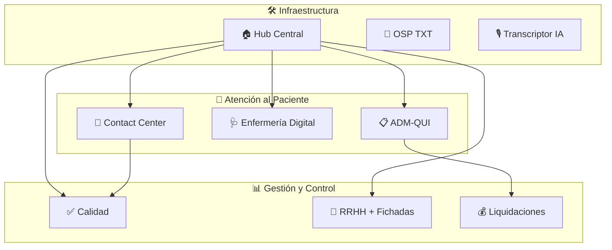
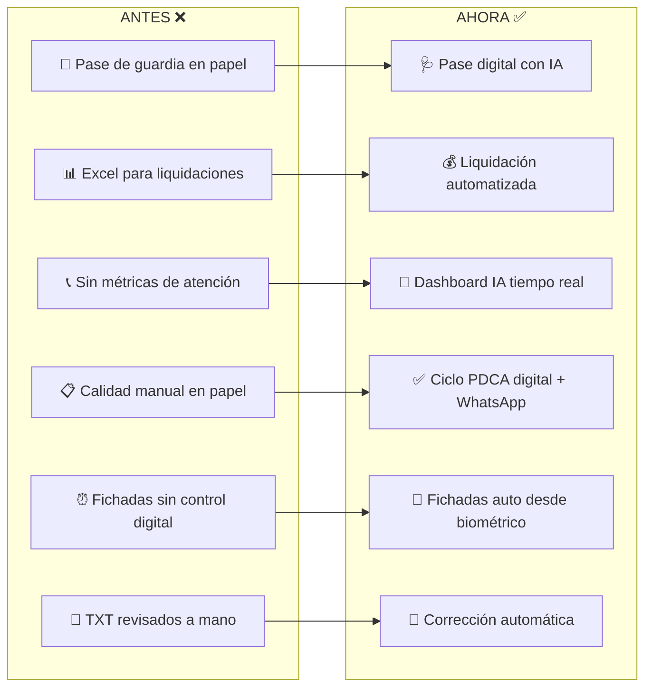

# 🏥 Ecosistema Digital — Sanatorio Argentino
### Reporte de Avance de Sistemas | Grow Labs — Abril 2026

---

## Visión General del Ecosistema

Se han desarrollado **9 sistemas operativos** que cubren desde la atención al paciente hasta la gestión administrativa, todos interconectados bajo una arquitectura moderna basada en la nube.

---

## 1. 💬 Contact Center — Analytics & IA

| | Detalle |
|---|---|
| **¿Qué hace?** | Dashboard de análisis integral del Contact Center (AsisteClick/WhatsApp). Procesa todas las conversaciones con pacientes, las clasifica con IA, mide sentimiento, detecta intenciones y genera reportes de rendimiento por agente. Incluye un sistema RAG (Retrieval-Augmented Generation) que permite al chatbot consultar documentación interna en tiempo real. |
| **¿Cómo lo hace?** | Las conversaciones ingresan vía webhooks desde AsisteClick → una Edge Function (Supabase) las procesa con **GPT-4o-mini** para extraer sentimiento, intención, calidad de respuesta y resumen. El frontend muestra dashboards con gráficos interactivos (Recharts), heatmaps de actividad horaria, filtros por agente/fecha, y genera **informes PDF descargables con análisis de IA**. El sistema RAG usa embeddings vectoriales para alimentar a un asistente conversacional ("Simón") con documentación normativa del sanatorio. |
| **¿Para qué lo hace?** | Para medir la calidad de atención al paciente en tiempo real, detectar problemas antes de que escalen, evaluar el rendimiento individual de cada agente, y tomar decisiones basadas en datos sobre dotación de personal y capacitación. |

> **Módulos:** Overview (KPIs), Conversaciones (detalle chat), Agentes (perfiles IA), Chatbot, Analytics IA (Simón), Bitácora, Turnos, RAG, Informes PDF

---

## 2. ✅ Calidad — Gestión de Eventos Adversos

| | Detalle |
|---|---|
| **¿Qué hace?** | Sistema completo del ciclo de gestión de calidad: desde el reporte inicial de un evento adverso hasta su resolución y seguimiento. Implementa el ciclo PDCA (Plan-Do-Check-Act) con derivación multi-sector, alertas SLA, métricas avanzadas y comunicación bidireccional por WhatsApp con los responsables. |
| **¿Cómo lo hace?** | Formularios inteligentes con grabación de audio (transcripción IA), derivación automática a sectores responsables, panel "Mis Casos" personalizado por rol, chat interno integrado con asistente IA ("Dora"), dashboard de métricas con filtros temporales, y notificaciones WhatsApp proactivas a los responsables de cada caso. |
| **¿Para qué lo hace?** | Para cumplir con los estándares de acreditación hospitalaria, reducir los tiempos de resolución de eventos adversos, generar trazabilidad completa de cada caso, y permitir a la Dirección Médica tomar acciones correctivas basadas en datos reales. |

> **Módulos:** Formulario de Reporte, Resolución, Seguimiento PDCA, Métricas Avanzadas, Alertas SLA, WhatsApp, Chat IA (Dora), Panel Mis Casos

---

## 3. 📋 ADM-QUI — Sistema de Admisión Quirúrgica

| | Detalle |
|---|---|
| **¿Qué hace?** | Gestiona todo el flujo de admisión de pacientes quirúrgicos: desde la búsqueda del paciente en SALUS, la carga de prácticas médicas con nomenclador, presupuestos, gestión de deudas, hasta la comunicación con el paciente vía WhatsApp. Incluye un módulo de turnos tipo "kiosco" y sincronización bidireccional con el sistema SALUS. |
| **¿Cómo lo hace?** | Un sync-server (Node.js) se conecta al SQL Server de SALUS para extraer cirugías, internaciones y datos de pacientes en tiempo real. El frontend tiene un carrito de prácticas con nomenclador integrado, impresión de presupuestos, gestión de deudas por obra social, envío de templates WhatsApp personalizados, y un módulo de métricas con indicadores de rendimiento del área. También incluye un panel de asistente IA ("Simón") para consultas internas. |
| **¿Para qué lo hace?** | Para eliminar la carga manual de datos duplicados entre SALUS y planillas, agilizar el proceso de admisión quirúrgica, mejorar la comunicación pre-quirúrgica con el paciente, y controlar las deudas pendientes por obra social. |

> **Módulos:** Home, Cirugías, Internaciones, Nomenclador, Presupuestos, Deudas, WhatsApp/Templates, Altas, Métricas, Config, Turnos Kiosco, Simón IA

---

## 4. 🩺 Enfermería Digital

| | Detalle |
|---|---|
| **¿Qué hace?** | Dashboard de enfermería para la gestión de pacientes internados. Permite visualizar todos los boxes con pacientes activos, registrar ingresos/egresos, documentar la evolución clínica de cada paciente, y realizar el pase de guardia digital con resumen generado por IA. |
| **¿Cómo lo hace?** | Dashboard visual tipo "mosaico" con el estado de cada box (libre/ocupado), detalle de paciente con historial de evoluciones, grabación de audio con transcripción automática (IA) para notas rápidas, y generación de resúmenes de pase de guardia basados en las novedades del turno. Persistencia en Supabase con autenticación por roles. |
| **¿Para qué lo hace?** | Para digitalizar el pase de guardia (antes en papel), reducir errores de comunicación entre turnos, acelerar el registro de novedades, y tener un historial auditable de la evolución de cada paciente internado. |

> **Módulos:** Dashboard de Boxes, Detalle de Paciente, Ingreso/Egreso, Evoluciones, Audio + Transcripción IA, Pase de Guardia

---

## 5. 👥 RRHH — Organigrama + Fichadas + Auditoría

| | Detalle |
|---|---|
| **¿Qué hace?** | Plataforma integral de Recursos Humanos que unifica: el organigrama institucional interactivo, la gestión de fichadas de todo el personal (importación desde PDF de reloj biométrico), visualización tipo calendario, detección de anomalías (recargos, ausencias), y módulo de auditoría de historias clínicas. |
| **¿Cómo lo hace?** | El organigrama se construye dinámicamente desde una jerarquía almacenada en Supabase con UI tipo "fluid hierarchy". El módulo de fichadas parsea los PDFs del reloj biométrico (general y sectorial), hace un "smart merge" para no perder datos sectoriales, detecta recargos por horas extras, y genera reportes exportables. El módulo de auditoría permite la revisión sistemática de historias clínicas. |
| **¿Para qué lo hace?** | Para tener visibilidad completa del personal y su estructura jerárquica, controlar las horas trabajadas sin depender de planillas manuales, detectar automáticamente recargos y anomalías, y cumplir con los requisitos de auditoría de historias clínicas. |

> **Módulos:** Organigrama Interactivo, Fichadas (Parser PDF), Calendario, Agenda, Auditoría HC, Home Institucional

---

## 6. 💰 Liquidaciones — Sistema de Liquidación Médica

| | Detalle |
|---|---|
| **¿Qué hace?** | Automatiza el cálculo de liquidaciones médicas. Permite cargar prácticas realizadas, aplicar reglas de cálculo por obra social y especialidad, generar liquidaciones PDF profesionales, y llevar un historial auditable de todas las liquidaciones procesadas. |
| **¿Cómo lo hace?** | Interfaz con Next.js que permite la carga y edición inline de prácticas, aplica fórmulas de liquidación configurables (por convenio, obra social y tipo de práctica), genera PDFs con diseño institucional, y almacena todo en Supabase. Incluye reglas de negocio para casos especiales (guardias, interconsultas, anestesia, etc.). |
| **¿Para qué lo hace?** | Para reducir los errores de cálculo en liquidaciones (antes manual en Excel), acelerar el proceso de pago a médicos, y tener trazabilidad completa de cada liquidación emitida. |

> **Módulos:** Carga de Prácticas, Reglas de Cálculo, Generación PDF, Historial, Edición Inline

---

## 7. 🏠 Hub Central — Portal Institucional

| | Detalle |
|---|---|
| **¿Qué hace?** | Portal central que unifica el acceso a todos los sistemas del Sanatorio. Gestiona usuarios, roles y permisos (RBAC), muestra el estado general de los sistemas, documentación, portfolio de proyectos, y monitoreo de actividad. Incluye protección anti-captura de pantalla. |
| **¿Cómo lo hace?** | SPA con TypeScript + Vite. Autenticación con Supabase Auth, roles jerárquicos (Global Admin, TyS, RRHH), dashboard de aplicaciones disponibles por rol, gestión de usuarios, documentación centralizada, y screenshot guard activo. |
| **¿Para qué lo hace?** | Para centralizar el acceso a todos los sistemas en un único punto con control de permisos por rol, garantizar la seguridad de la información, y facilitar el onboarding de nuevos usuarios. |

> **Módulos:** Dashboard, Admin, Usuarios, Monitor, Portfolio, Documentación

---

## 8. 📄 OSP TXT — Corrector de Prestaciones

| | Detalle |
|---|---|
| **¿Qué hace?** | Herramienta especializada para analizar, comparar y corregir archivos TXT de prestaciones médicas para la Obra Social Provincial. Detecta DNIs duplicados, compara contra el Excel de referencia, y genera un archivo TXT corregido automáticamente. |
| **¿Cómo lo hace?** | Carga simultánea de TXT (formato OSP) y Excel (fuente confiable). Algoritmo de matching inteligente por fecha + importe con selección por menor diferencia. Sumatorias cruzadas por código de prestación, detección de faltantes, y descarga del archivo corregido. |
| **¿Para qué lo hace?** | Para eliminar las horas de revisión manual de archivos TXT de facturación a la obra social, reducir rechazos por errores de datos, y asegurar la consistencia entre lo facturado y lo prestado. |

> **Módulos:** Carga de Archivos, Análisis de Duplicados, Matching Inteligente, Sumatorias, Descarga Corregida

---

## 9. 🎙️ Transcriptor IA — Reuniones y Actas

| | Detalle |
|---|---|
| **¿Qué hace?** | Plataforma para grabar o subir audios de reuniones, transcribirlos automáticamente con IA, y generar actas estructuradas con puntos clave, decisiones y responsables asignados. |
| **¿Cómo lo hace?** | Backend en Python (FastAPI) que recibe audios, los procesa con servicios de transcripción (Whisper/OpenAI), y genera resúmenes inteligentes. Frontend con interfaz de grabación en vivo, historial de reuniones, y visualización de actas con detalle por reunión. Incluye sistema de planes/suscripción. |
| **¿Para qué lo hace?** | Para tener registro formal y auditable de las reuniones institucionales, eliminar la toma de notas manual, y asegurar que las decisiones y compromisos queden documentados. |

> **Módulos:** Grabación en Vivo, Upload de Audio, Transcripción IA, Actas Automáticas, Historial, Dashboard

---

## Cuadro Resumen del Ecosistema

| # | Sistema | Área de Impacto | Tecnología Core | Estado |
|---|---------|-----------------|-----------------|--------|
| 1 | Contact Center | Atención al Paciente | Vite + Recharts + GPT-4o + RAG | ✅ Producción |
| 2 | Calidad | Dirección Médica | Vite + Supabase + WhatsApp | ✅ Producción |
| 3 | ADM-QUI | Admisión Quirúrgica | Vite + SALUS Sync + WhatsApp | ✅ Producción |
| 4 | Enfermería | Internación | Vite + Tailwind + IA Audio | ✅ Producción |
| 5 | RRHH | Recursos Humanos | Vite + PDF Parser + Supabase | ✅ Producción |
| 6 | Liquidaciones | Facturación Médica | Next.js + Supabase | ✅ Producción |
| 7 | Hub Central | IT / Seguridad | Vite + TypeScript + RBAC | ✅ Producción |
| 8 | OSP TXT | Facturación OSP | Vite + TypeScript | ✅ Producción |
| 9 | Transcriptor IA | Dirección / Comités | FastAPI + Whisper + React | ✅ Producción |

---

## Impacto Transformacional

### Pilares de la Transformación:
- **🤖 Inteligencia Artificial** integrada en 6 de 9 sistemas (análisis, transcripción, asistentes, reportes)
- **📱 WhatsApp institucional** como canal de comunicación bidireccional con pacientes y responsables
- **🔗 Integración con SALUS** para eliminar doble carga de datos
- **☁️ Arquitectura cloud** (Supabase) para acceso desde cualquier dispositivo
- **📊 Datos en tiempo real** para toma de decisiones basada en evidencia

---

> *Desarrollado por **Grow Labs** para **Sanatorio Argentino** — Donde tus ideas crecen 🌱*
